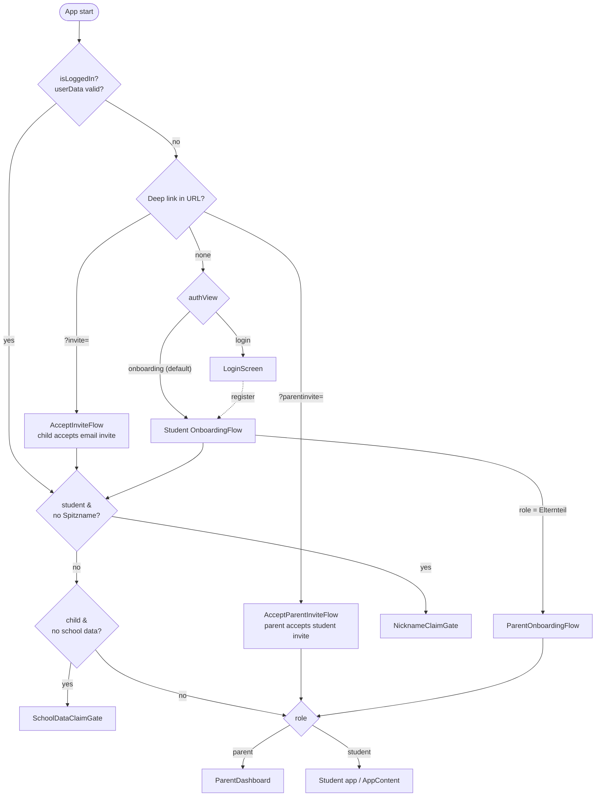
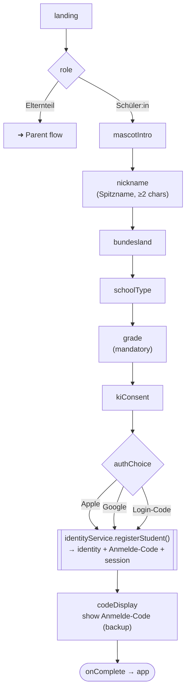
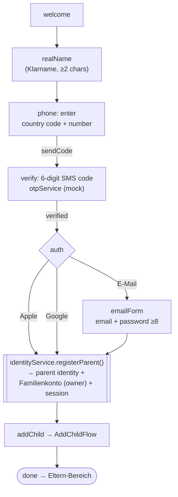
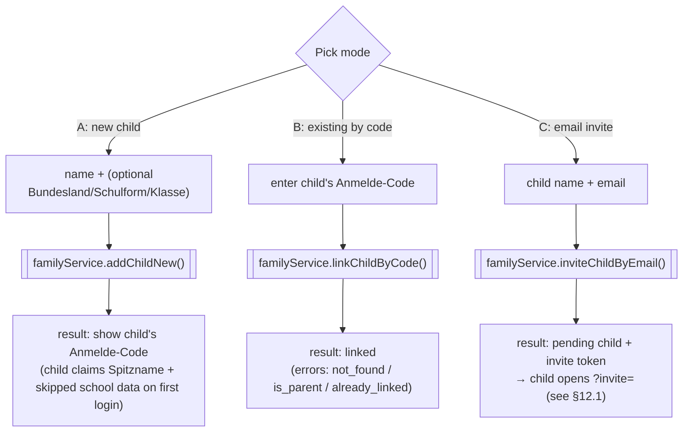
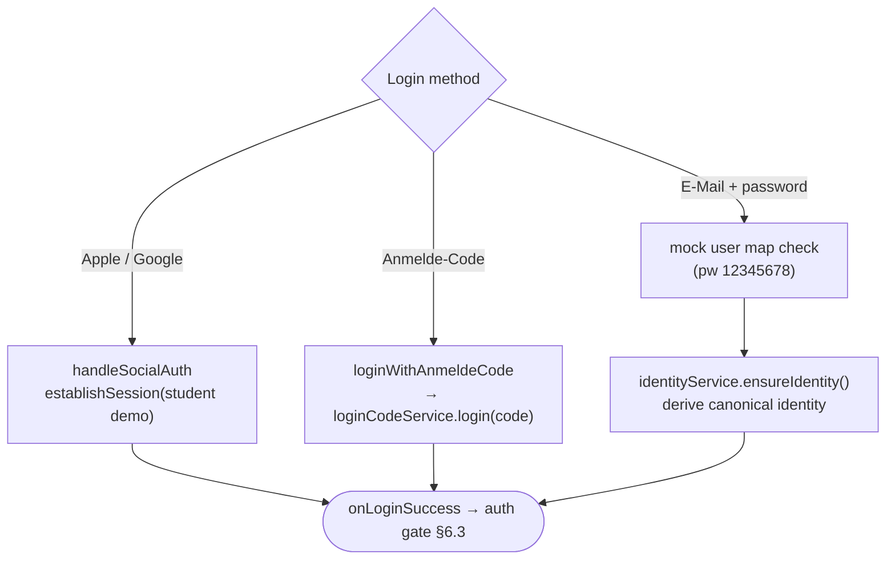

# SoStudy — Registration & Authentication Flow (Complete Reference)

> **Purpose.** A single, implementation-ready specification of the entire onboarding /
> registration / login system used in the SoStudy prototype — student **and** parent paths,
> plus login, first-login gates, and the family-account / invite mechanics.
>
> **Scope.** Everything in this doc is **real, verified behavior** read out of the source
> (file + line references throughout). The prototype has **no backend** — everything runs on
> mock services + `localStorage`. Every mock is a deliberate **seam** for a later Supabase swap;
> the migration mapping is in [§14](#14-backend-migration-guide-supabase).
>
> **Language note.** Prose is English so this is portable. German **domain terms are part of the
> data model** and are kept verbatim: *Spitzname* (nickname), *Klarname* (legal name),
> *Anmelde-Code* (login code), *Familienkonto* (family account), *Volljährigkeit* (legal adulthood).
> UI strings are German.

---

## Table of contents

1. [Mental model (read this first)](#1-mental-model-read-this-first)
2. [File map](#2-file-map)
3. [Core enums & vocabulary](#3-core-enums--vocabulary)
4. [Data model](#4-data-model)
5. [Storage model (localStorage keys)](#5-storage-model-localstorage-keys)
6. [App entry & the auth gate (`AuthWrapper`)](#6-app-entry--the-auth-gate-authwrapper)
7. [Student registration flow](#7-student-registration-flow)
8. [Parent registration flow](#8-parent-registration-flow)
9. [Add-a-child flow (modes A / B / C)](#9-add-a-child-flow-modes-a--b--c)
10. [Login flow](#10-login-flow)
11. [First-login gates (Nickname / School-data)](#11-first-login-gates)
12. [Invite flows (deep links)](#12-invite-flows-deep-links)
13. [Service & mock API reference](#13-service--mock-api-reference)
14. [Backend migration guide (Supabase)](#14-backend-migration-guide-supabase)
15. [Test accounts & seeded demo data](#15-test-accounts--seeded-demo-data)
16. [Edge cases & gotchas](#16-edge-cases--gotchas)
17. [Re-implementation checklist](#17-re-implementation-checklist)

> 📊 **Visual flowcharts** (Mermaid): [Flow diagrams at a glance](#flow-diagrams-at-a-glance) —
> a graphical overview of every path described in §6–§12. Renders on GitHub; otherwise paste into
> <https://mermaid.live>.

---

## Flow diagrams at a glance

> These mirror the verified state machines in §6–§12. Node labels use the real `Step`/`Phase`
> names from the source so you can map a box straight to code.

### A. App entry & auth gate (§6)



### B. Student registration (§7)



### C. Parent registration (§8)



### D. Add a child — modes A / B / C (§9)



### E. Login — three methods (§10)



### F. Invite flows — service orchestration (§12)

```mermaid
flowchart LR
  subgraph Child accepts email invite "?invite="
    CI1[AcceptInviteFlow] --> CI2[["familyService.acceptInviteWithAuth()"]]
    CI2 --> CI3["new student identity + own Anmelde-Code<br/>establishSession → child logged in"]
    CI3 --> CI4[NicknameClaimGate]
  end
  subgraph Parent accepts student invite "?parentinvite="
    PI1[AcceptParentInviteFlow<br/>data → phone/OTP → auth] --> PI2[["parentInviteService.accept()"]]
    PI2 --> PI3[["identityService.registerParent()"]]
    PI2 --> PI4[["familyService.linkChildById()<br/>tutoringConsent: true"]]
    PI3 --> PI5([parent logged in → ParentDashboard])
    PI4 --> PI5
  end
```

---

## 1. Mental model (read this first)

Six ideas explain the whole system. Internalize these and the rest is detail.

1. **Two-name model — *Spitzname* vs *Klarname*.**
   - `display_name` (*Spitzname*) — a casual nickname. Drives **every greeting in the app**.
     **Required for students** (can be a fantasy name). For parents it's auto-derived from the
     first word of their real name.
   - `real_name` (*Klarname*) — the legal name. Used **only** in the tutoring / contract /
     family-account context. For students it starts **empty** (`''`) and is filled later, only
     when tutoring is activated. **Required for parents** (they sign contracts).

2. **Students always get an *Anmelde-Code*; parents never do.**
   Every student identity is issued a permanent, shareable login code (Anton-style, e.g.
   `ALEX-7K2P`) — even if they sign in with Apple/Google (then it's a **backup**). Parents secure
   their account with Apple/Google/E-Mail+password **only** (sensitive data → no shareable code).

3. **Everything is mocked in `localStorage`.** No network, no real auth. Mock services simulate
   API latency with `setTimeout`. Data lives in module-level objects mirrored to `localStorage`
   so it survives reloads (reliable demos).

4. **Onboarding runs *before* the login gate.** `AuthWrapper` shows the onboarding/login screens
   when logged-out, and the app when logged-in. There is **no router library** — navigation is
   state machines (`useState`) inside each flow component.

5. **The family account is the hub.** A *parent* (`familyRole: 'owner'`) owns a `Familienkonto`
   that links 1..n *children* (`familyRole: 'child'`). Children attach via one of **three
   activation modes** (A/B/C). Two **invite deep links** exist (child←parent email; parent←student).

6. **`userData` is the compatibility shape; `SoStudyIdentity` is canonical.**
   The new onboarding writes a canonical `SoStudyIdentity` (`sostudy_identity`) **and** a legacy
   `userData` object that older code (`AuthWrapper`, `UserContext`, role routing) already
   understands. `identityService.identityToUserData()` bridges them.

---

## 2. File map

| Layer | File | Responsibility |
|---|---|---|
| **Entry** | `src/main.tsx` → `src/app/App.tsx` | Mounts app. `App` wraps `AuthWrapper`; routes logged-in user by `role`. |
| **Auth gate** | `src/app/components/AuthWrapper.tsx` | Logged-in check, deep-link handling, view switching, first-login gates. |
| **Student onboarding** | `src/app/components/onboarding/OnboardingFlow.tsx` | Full student signup state machine. |
| **Parent onboarding** | `src/app/components/parent/ParentOnboardingFlow.tsx` | Full parent signup + family creation + first child. |
| **Add child** | `src/app/components/parent/AddChildFlow.tsx` | Modes A/B/C for attaching a child. |
| **Parent home** | `src/app/components/parent/ParentDashboard.tsx` | Where a logged-in parent lands. |
| **Login** | `src/app/components/LoginScreen.tsx` | Social / Anmelde-Code / E-Mail login. |
| **Legacy register** | `src/app/components/RegisterScreen.tsx` | Old form-based register (fallback only). |
| **First-login gates** | `onboarding/NicknameClaimGate.tsx`, `onboarding/SchoolDataClaimGate.tsx` | Child claims nickname / school data on first login. |
| **Invite (child)** | `onboarding/AcceptInviteFlow.tsx` | Child accepts email invite (`?invite=`). |
| **Invite (parent)** | `onboarding/AcceptParentInviteFlow.tsx` | Parent accepts student invite (`?parentinvite=`). |
| **Phone/OTP UI** | `onboarding/PhoneOtpFields.tsx` | Presentational phone + OTP fields. |
| **Phone/OTP logic** | `src/hooks/usePhoneOtp.ts` | Phone entry + SMS-OTP state machine. |
| **Shared UI** | `onboarding/OnboardingShared.tsx` | `BRAND`, lists (`BUNDESLAENDER`…), shell + button primitives. |
| **Types** | `src/types/identity.ts` | All canonical interfaces + empty drafts. |
| **Service: identity** | `src/services/identityService.ts` | Register, session, code login, profile mutations. |
| **Service: family** | `src/services/familyService.ts` | Child create/link/invite, codes, consent. |
| **Service: login codes** | `src/services/loginCodeService.ts` | Code generate/login/reset (mirrors `login_codes` table). |
| **Service: OTP** | `src/services/otpService.ts` | SMS-OTP request/verify (mock). |
| **Service: parent invite** | `src/services/parentInviteService.ts` | Student→parent invite lifecycle. |
| **Legacy auth utils** | `src/lib/auth.ts` | `getCurrentUserId`, `isAuthenticated`, `getUserStorageKey`, `clearUserSession`, mock users. |
| **Mocks** | `src/mocks/{identity,family,loginCodes,parentInvites}.mock.ts` | In-memory stores + `localStorage` mirror + generators. |
| **Supabase placeholder** | `utils/supabase/info.ts` | `projectId` / `publicAnonKey` (placeholders → mock mode). |

---

## 3. Core enums & vocabulary

From `src/types/identity.ts`:

```ts
type UserRole      = 'student' | 'parent';
type AuthMethod    = 'apple' | 'google' | 'anmeldeCode' | 'email';
type ActivationMode = 'A' | 'B' | 'C';   // how a child attaches to a family
type FamilyRole    = 'owner' | 'child';
type ParentInviteStatus = 'pending' | 'accepted' | 'withdrawn';
```

**Activation modes** (how a child-account joins a family):
- **A** — Parent **creates a new** child account (parent-first → system generates an Anmelde-Code).
- **B** — Link an **existing** child account by its **Anmelde-Code** (child-first → parent attaches).
- **C** — Link a child by **email invitation** (parent sends an invite token; child accepts).

---

## 4. Data model

### 4.1 `SoStudyIdentity` — the canonical identity (`types/identity.ts:29`)

```ts
interface SoStudyIdentity {
  userId: string;
  role: UserRole;

  // Two-bubble name model
  display_name: string;   // Spitzname — '' until a child claims it on first login
  real_name: string;      // Klarname — '' until tutoring activation requires it

  // School personalization (empty for parents)
  bundesland: string;
  schoolType: string;
  grade?: string;         // optional / skippable

  volljaehrig: boolean;   // self-declared adulthood → drives the tutoring matrix

  anmeldeCode: string;    // '' = no active code (parents); students always have one

  authMethod: AuthMethod;
  linkedAuthMethods?: AuthMethod[]; // social logins linked afterwards (mocked)
  kiConsent: KiConsent;
  email?: string;
  phone?: string;         // verified phone — parents: mandatory; 18+ students: for tutoring

  // Family linkage
  familyId?: string;      // parent: own family; child: parent's family
  familyRole?: FamilyRole;

  createdAt: string;      // ISO
}

interface KiConsent { accepted: boolean; timestamp?: string; }
```

### 4.2 Onboarding drafts (collected step-by-step, submitted at the end)

```ts
// Student — onboarding/OnboardingFlow.tsx collects this, then registerStudent()
interface OnboardingDraft {
  role: UserRole | null;
  display_name: string;
  bundesland: string;
  schoolType: string;
  grade?: string;
  kiConsentAccepted: boolean;
  authMethod: AuthMethod | null;
  email?: string;
}

// Parent — parent/ParentOnboardingFlow.tsx collects this, then registerParent()
interface ParentOnboardingDraft {
  real_name: string;          // mandatory
  phone?: string;             // mandatory, verified via SMS-OTP
  email?: string;
  kiConsentAccepted: boolean;
  authMethod: AuthMethod | null;
}
```

`EMPTY_ONBOARDING_DRAFT` / `EMPTY_PARENT_ONBOARDING_DRAFT` are the initial values.

### 4.3 Family account (`types/identity.ts:70`)

```ts
interface Familienkonto {
  familyId: string;
  parentUserId: string;
  parentRealName: string;     // mandatory in contract context
  parentEmail?: string;       // for tutoring contract delivery
  parentPhone?: string;       // verified parent phone for callbacks
  children: FamilyChild[];
  createdAt: string;
}

interface FamilyChild {
  childUserId: string;        // references a SoStudyIdentity (role 'student')
  display_name: string;       // Spitzname (shown in the children list)
  real_name: string;          // Klarname (for tutoring/contract); '' until set
  anmeldeCode: string;        // child login code; for a pending invite, the invite token
  email?: string;             // for mode C (email invite)
  bundesland?: string;        // school data optional: parents may skip → child fills on first login
  schoolType?: string;
  grade?: string;
  activationMode: ActivationMode;
  tutoringConsent: boolean;   // parent consent to tutoring for this child
  pending: boolean;           // true = invite (mode C) not yet accepted
  linkedAt: string;
}
```

### 4.4 Login-code record (`mocks/loginCodes.mock.ts:10`) — mirrors planned `login_codes` table

```ts
interface LoginCodeRecord {
  code: string;          // PK
  userUuid: string;      // FK → identity
  createdAt: string;
  lastUsedAt?: string;   // audit
  isActive: boolean;     // false after reset (old code invalidated)
}
```

### 4.5 Parent invite (`mocks/parentInvites.mock.ts:9`)

```ts
interface ParentInvite {
  token: string;          // magic-link token "EINLADUNG-XXXXXX"
  studentUserId: string;  // who invited
  parentEmail: string;
  parentMobile?: string;  // optional SMS backup
  status: 'pending' | 'accepted' | 'withdrawn';
  createdAt: string;
  updatedAt: string;
}
```

### 4.6 `userData` — legacy compatibility shape

Produced by `identityService.identityToUserData(identity)` (`identityService.ts:34`) and stored
at `userData`. This is what `AuthWrapper`, role routing, and `UserContext` consume:

```ts
{
  userId, role,
  firstName: display_name,   // ← greeting uses the Spitzname
  lastName: '',
  display_name, real_name,
  email, phone, bundesland, schoolType, grade,
  volljaehrig, anmeldeCode, authMethod, linkedAuthMethods,
  familyId, familyRole,
}
```

> `src/lib/auth.ts` defines an older `UserProfile` (`userId/email/firstName/lastName/createdAt`
> + optional v5 fields). It still backs helpers like `getCurrentUserId()` and the mock-user map.
> New code should treat `SoStudyIdentity` as the source of truth and `userData` as the projection.

### 4.7 ID & code formats (generators)

| Thing | Format | Generator |
|---|---|---|
| `userId` | `user_${Date.now()}_${rand6}` | inline in services |
| pending child id | `pending_${Date.now()}_${rand4}` | `familyService.inviteChildByEmail` |
| `familyId` | `fam_${Date.now()}_${rand6}` | `generateFamilyId()` (`family.mock.ts:11`) |
| Anmelde-Code | 2×4 chars, `-` separator, e.g. `MIRA-7K2P` | `generateAnmeldeCode()` (`identity.mock.ts:17`) |
| Invite token (mode C & parent invite) | `EINLADUNG-${rand6}` | `generateInviteCode()` (`family.mock.ts:16`) |
| OTP code | 6 digits | `otpService` (`gen6`) |

Code alphabet excludes ambiguous chars: `ABCDEFGHJKMNPQRSTUVWXYZ23456789` (no `0/O/1/I/L`).

---

## 5. Storage model (localStorage keys)

| Key | Written by | Holds | Cleared on logout? |
|---|---|---|---|
| `userData` | `persistSession`, `LoginScreen` | legacy compat shape (§4.6) | ✅ |
| `sostudy_identity` | `persistSession` | the **current** `SoStudyIdentity` (JSON) | ✅ |
| `sostudy_identities` | `persistIdentities` | **all** identities (mirror of `MOCK_IDENTITIES`) | ❌ (kept) |
| `sostudy_families` | `persistFamilies` | all `Familienkonto`s | ❌ (kept) |
| `sostudy_login_codes` | `persistLoginCodes` | all `LoginCodeRecord`s | ❌ (kept) |
| `sostudy_parent_invites` | `persistParentInvites` | all `ParentInvite`s | ❌ (kept) |
| `isLoggedIn` | `persistSession`, `LoginScreen` | `'true'` | ✅ |
| `isNewRegistration` | `persistSession(isNew=true)` | `'true'` (just-registered marker) | ✅ |
| `hasSeededTestUser` | `AuthWrapper` seed effect | guard so seeding runs once | ❌ |
| `sostudy_${userId}_${key}` | `getUserStorageKey()` | **user-scoped** feature data | (per-feature) |

**`clearUserSession()`** (`lib/auth.ts:195`) removes: `userData`, `userAccountData`, `userName`,
`userProfileImage`, `tutoringStatus`, `tutoringRequestData`, `isLoggedIn`, `isNewRegistration`,
`sostudy_identity`.

> **Why `sostudy_identities` / `sostudy_families` survive logout:** so accounts created at runtime
> (parent-created children, etc.) keep working for the next Anmelde-Code login. This is the
> mock standing in for a server database.

---

## 6. App entry & the auth gate (`AuthWrapper`)

```
main.tsx → App.tsx
            └─ <AuthWrapper>  (render-prop: (userData, handleLogout) => ReactNode)
                 ├─ logged OUT → onboarding / login / register / invite views
                 └─ logged IN  → [first-login gates] → children(userData, handleLogout)
                                   └─ App routes by role:
                                        role === 'parent' → <ParentDashboard/>   (App.tsx:108)
                                        else              → <AppContent/>        (student app)
```

### 6.1 `authView` state machine (`AuthWrapper.tsx:39`)

```
type authView = 'login' | 'register' | 'onboarding' | 'parentOnboarding'
              | 'acceptInvite' | 'acceptParentInvite'
default: 'onboarding'
```

On mount (`AuthWrapper.tsx:48`):
1. Parse URL: `?invite=<token>` and `?parentinvite=<token>`.
2. If `localStorage.isLoggedIn === 'true'` **and** `userData` parses → set logged in.
   - Corrupt `userData` → cleared, treated as logged out (prevents black-screen on boot).
3. Else if `?invite` present → `authView = 'acceptInvite'`.
4. Else if `?parentinvite` present → `authView = 'acceptParentInvite'`.
5. A dev-only effect (`AuthWrapper.tsx:79`) optionally seeds a Supabase test user **only if real
   credentials are configured** (they aren't in the prototype — it no-ops and sets the guard).

### 6.2 View routing while logged out (`AuthWrapper.tsx:134`)

| `authView` | Renders | Switch handlers |
|---|---|---|
| `onboarding` (default) | `OnboardingFlow` | →`login`, →`parentOnboarding` (via role pick) |
| `parentOnboarding` | `ParentOnboardingFlow` | →back to `onboarding` |
| `login` | `LoginScreen` | →`onboarding` (register), social-new-user →`register` |
| `register` | `RegisterScreen` (legacy) | →`login` |
| `acceptInvite` | `AcceptInviteFlow` | on done → logged in; invalid → `onboarding` |
| `acceptParentInvite` | `AcceptParentInviteFlow` | on done → logged in; invalid → `onboarding` |

`SocialAuthInfo` (`{ provider, email, firstName?, lastName? }`) is passed from login to register
when a social login turns out to be a brand-new user (legacy path).

### 6.3 First-login gates (post-login, pre-app) (`AuthWrapper.tsx:195`)

Checked in order, **before** rendering the app:
1. **Nickname gate** — `role === 'student'` **and** `display_name` is blank → `NicknameClaimGate`.
2. **School-data gate** — `role === 'student'` **and** `familyRole === 'child'` **and**
   (`schoolType` blank **or** `grade` blank) → `SchoolDataClaimGate`.

Self-registered students set these in onboarding, so the gates only fire for **parent-created /
invited children** whose data was skipped. See [§11](#11-first-login-gates).

---

## 7. Student registration flow

**Component:** `onboarding/OnboardingFlow.tsx`. Linear state machine over `Step`.

```
FLOW = landing → role → mascotIntro → nickname → bundesland → schoolType → grade
       → kiConsent → authChoice → (codeDisplay)
```
- `goNext`/`goBack` walk the `FLOW` array; progress bar starts at `mascotIntro` (`PROGRESS_STEPS`).
- `draft` (`OnboardingDraft`) accumulates answers; `set(patch)` merges.

| Step | UI / question | Validation to advance | Writes to draft |
|---|---|---|---|
| `landing` | Logo + value prop. "Neuen Account erstellen" / "Bereits ein Konto? Anmelden" | — | — |
| `role` | "Wer bist du?" — Schüler:in vs Elternteil | a role selected | `role` |
| | **If `role === 'parent'` → `onSwitchToParent()`** (jumps to parent flow) | | |
| `mascotIntro` | Mascot "Sumi" intro | — | — |
| `nickname` | "Wie soll ich dich nennen?" (Spitzname) | `display_name.trim().length >= 2` | `display_name` |
| `bundesland` | Pick Bundesland (`BUNDESLAENDER`, 2-col) | non-empty | `bundesland` |
| `schoolType` | Pick Schulform (`SCHOOL_TYPES`, 2-col) | non-empty | `schoolType` |
| `grade` | Pick Klassenstufe (`GRADES`, 3-col) — **mandatory** | non-empty | `grade` |
| `kiConsent` | AI consent (Art. 6/49 DSGVO). "Zustimmen & weiter" | click = accept | `kiConsentAccepted = true` |
| `authChoice` | **Apple** (primary) / **Google** / text-link "Login-Code nutzen" | pick a method | calls `handleRegister(method)` |
| `codeDisplay` | Shows the issued **Anmelde-Code** (tap to copy) | "Weiter zum Dashboard" → `finish()` | — |

**Registration (`handleRegister`, `OnboardingFlow.tsx:78`):**
```ts
const identity = await identityService.registerStudent({ ...draft, authMethod: method });
setStep('codeDisplay');
```
`registerStudent` (`identityService.ts:102`) builds a `SoStudyIdentity` with:
`role:'student'`, `real_name:''`, `volljaehrig:false`, a freshly generated `anmeldeCode`,
`linkedAuthMethods:[method]` if Apple/Google (else `[]`), the `kiConsent`, then
`persistSession(identity, isNew=true)` + `recordLoginCode(...)`.

**`codeDisplay`** always shows the Anmelde-Code — even after Apple/Google — framed as a backup
("Falls du dich mal nicht mit Apple/Google anmelden kannst… Dein Elternteil sieht ihn auch im
Familienkonto."). `finish()` reads `userData` from storage and calls `onComplete(userData)`.

> **Apple/Google are visually mocked** — there's no real OAuth. Picking them just records the
> method on the identity and issues the code.

---

## 8. Parent registration flow

**Component:** `parent/ParentOnboardingFlow.tsx`. Phase machine:

```
welcome → realName → phone(enter→verify→verified) → auth → (emailForm)
        → addChild (AddChildFlow) → done
PROGRESS = [realName, phone, auth]
```

| Phase | UI | Advance condition | Effect |
|---|---|---|---|
| `welcome` (E1) | Logo + "Schön, dass du dabei bist!" | "Los geht's" | → `realName` |
| `realName` (E2) | "Wie heißt du?" — **Klarname** (Vor- und Nachname) | `real_name.trim().length >= 2` | sets `real_name` → `phone` |
| `phone` (E2b) | Country-code picker + phone, then SMS-OTP | see §8.1 | on OTP success: `phone` set → `auth` |
| `auth` (E3) | "So sicherst du dein Familienkonto." Apple / Google / link "Mit E-Mail registrieren" | pick method | `handleRegister(method)` |
| `emailForm` (E3b) | E-Mail + password (≥ 8 chars), show/hide | `emailValid && pwValid` | `handleRegister('email', email)` |
| `addChild` (E4–E6) | `AddChildFlow` (allowSkip) | done/cancel | → `done` |
| `done` (E7) | "Dein Familienkonto ist startklar! 🎉" | "Zum Eltern-Bereich" → `finish()` | — |

> **No Anmelde-Code, no KI-consent screen for parents.** Parent accounts must be secured
> (Apple/Google/E-Mail). The KI consent belongs to the student context (or is given implicitly
> when the parent creates a child).

### 8.1 Phone + SMS-OTP sub-flow

UI: `onboarding/PhoneOtpFields.tsx` (presentational). Logic: `hooks/usePhoneOtp.ts`. Mock backend:
`services/otpService.ts`. The host (parent flow) supplies the action buttons.

`usePhoneOtp(onVerified)` returns `{ countryCode, setCountryCode, phone, setPhone, phoneValid,
stage, otp, setOtp, demoCode, error, busy, resendIn, fullPhone, sendCode, verify, changeNumber,
verified }`.

- **Country codes:** `COUNTRY_CODES` (default `+49`; DE/AT/CH/NL/FR/IT/ES/GB/TR/PL).
- **`fullPhone`** = `` `${countryCode} ${phone.trim()}` ``.
- **`phoneValid`** = any non-empty input. *(Prototype rule — see [§16](#16-edge-cases--gotchas).
  Originally required ≥ 6 digits; loosened so the field accepts anything.)*
- **stages:** `enter` → `verify` → `verified`.
  - `sendCode()` → `otpService.requestCode(fullPhone)` (mock **always ok**, returns a 6-digit
    `demoCode` shown in a "Demo — dein SMS-Code" box). Starts a 60 s resend countdown.
  - `verify()` → `otpService.verifyCode(fullPhone, otp)`. On ok → `verified` + `onVerified(fullPhone)`.
    Failure reasons: `wrong` (retry), `too_many` (after 3 → new code), `expired` / `no_code`.
- OTP rules (`otpService.ts`): 6-digit code, **10-min TTL**, **3 attempts**, in-memory per
  normalized phone (`requestCode` overwrites any open code).

**Registration (`handleRegister`, `ParentOnboardingFlow.tsx:70`):**
```ts
const { family } = await identityService.registerParent({ ...draft, authMethod, email });
setFamilyId(family.familyId);
setPhase('addChild');
```
`registerParent` (`identityService.ts:138`):
- creates a `Familienkonto` (`owner`) with `parentRealName/parentEmail/parentPhone`, empty `children`,
  stores it in `MOCK_FAMILIES` + `persistFamilies()`;
- creates the parent `SoStudyIdentity`: `role:'parent'`, `display_name = realName.split(' ')[0]`,
  `real_name = realName`, `volljaehrig:true`, `anmeldeCode:''`, `familyId`, `familyRole:'owner'`,
  `phone`, `email`, `kiConsent`;
- `persistSession(identity, isNew=true)`. Returns `{ identity, family }`.

---

## 9. Add-a-child flow (modes A / B / C)

**Component:** `parent/AddChildFlow.tsx`. Reached at the end of parent onboarding (`allowSkip`) and
from the Parent Dashboard. The parent first picks a mode, then a mode-specific detail flow, then a
result screen.

| Mode | Meaning | Detail steps | Service call | Result |
|---|---|---|---|---|
| **A** | Create a **new** child account | name → (Bundesland → Schulform → Klasse, **skippable**) | `familyService.addChildNew(familyId, { real_name, bundesland?, schoolType?, grade?, tutoringConsent? })` | new student identity + Anmelde-Code; child claims Spitzname (+ skipped school data) on first login |
| **B** | Link an **existing** child by code | enter the child's Anmelde-Code | `familyService.linkChildByCode(familyId, code)` | existing student bound to family |
| **C** | Invite by **email** | child name + email | `familyService.inviteChildByEmail(familyId, { real_name, email, schoolType?, grade? })` | `pending` child + invite token; child opens `?invite=` (§12.1) |

- **Mode A** sets `kiConsent.accepted = true` (parent consents on the child's behalf) and
  `pending:false`. School data may be skipped ("Mein Kind macht das später") → filled by the
  child via `SchoolDataClaimGate`.
- **Mode B** rejects: not found (`reason:'not_found'`), the code belongs to a parent
  (`'is_parent'`), or already linked (`'already_linked'`).
- **Mode C** stores the invite token in the pending child's `anmeldeCode` field until acceptance.

`LinkResult = { ok:true; family; child } | { ok:false; reason:'not_found'|'already_linked'|'is_parent' }`.

---

## 10. Login flow

**Component:** `LoginScreen.tsx`. Two internal views: `main` and `email`. Three login methods.

### 10.1 Social login (Apple / Google) — `handleSocialAuth` (`LoginScreen.tsx:66`)
- Simulates OAuth with a 1.2 s delay, then logs in the **fully-populated student mock**
  (`MOCK_STUDENT_ID = 'user_alexanderbaum_mock_123'`) via `identityService.establishSession(identity, false)`.
- Writes `userData`, calls `onLoginSuccess`. No name/data gate (full profile).
- *(Parents use the e-mail login in the prototype; social login always lands as the student demo.)*

### 10.2 Anmelde-Code login — `handleCodeLogin` (`LoginScreen.tsx:45`)
- Trims/uppercases the code → `identityService.loginWithAnmeldeCode(code)`.
- That calls `loginCodeService.login(code)`:
  - active code → returns `userUuid` and stamps `lastUsedAt`;
  - **self-healing:** if the code isn't in the code store yet but **is** on an identity, it's
    re-recorded as active (keeps prototype login robust).
- → `findIdentityById(userUuid)` → `persistSession`. Invalid code → "Ungültiger Anmelde-Code".

### 10.3 E-Mail + password — `handleLogin` (`LoginScreen.tsx:89`)
- If real Supabase credentials are configured (`projectId`/`publicAnonKey` ≠ placeholders) → real
  `fetch` to the edge function `…/auth/login`. **In the prototype this branch is inactive.**
- Otherwise **mock login** against an inline map (password `12345678`):

  | Email | userId | role | family |
  |---|---|---|---|
  | `alexanderbaum@gmail.com` | `user_alexanderbaum_mock_123` | student | — |
  | `newuser@sostudytest.com` | `user_newuser_mock_456` | student | — |
  | `parent@sostudytest.com` | `user_parent_mock_789` | parent | `fam_mock_001` (owner) |

  On success: writes `isLoggedIn` + `userData`, then `identityService.ensureIdentity()` derives a
  canonical `sostudy_identity` from `userData` (so family/tutoring features work after an e-mail login).
- **Forgot password** is mocked: shows "Wir haben dir einen Link… gesendet." (no email sent).

### 10.4 `ensureIdentity()` bridge (`identityService.ts:216`)
Legacy logins write only `userData`. `ensureIdentity()` reconstructs a `SoStudyIdentity` from it
(students get a fresh Anmelde-Code; parents get `''`) and persists it — so identity-dependent
features (Klarname gate, Volljährigkeit, Familienkonto) work regardless of login path.

---

## 11. First-login gates

Rendered by `AuthWrapper` **after** login, **before** the app (see §6.3). Both call `setUserData`
with the refreshed `userData` on completion so the gate disappears.

### 11.1 `NicknameClaimGate` (`onboarding/NicknameClaimGate.tsx`)
- **When:** logged-in student with blank `display_name` (parent-created/invited child).
- **Collects:** a Spitzname.
- **Calls:** `identityService.setDisplayName(name)` → sets `display_name`, re-persists session.

### 11.2 `SchoolDataClaimGate` (`onboarding/SchoolDataClaimGate.tsx`)
- **When:** logged-in `child` student missing `schoolType`/`grade` (parent skipped them in mode A).
- **Steps:** Bundesland → Schulform → Klasse (3 screens).
- **Calls:** `identityService.setSchoolData({ bundesland?, schoolType?, grade? })`, which also
  syncs the values back into the family's child record (`syncFamilyChildSchool`).

---

## 12. Invite flows (deep links)

### 12.1 Child accepts an email invite — `?invite=<token>` (mode C)
- **Trigger:** `AuthWrapper` reads `?invite` → `AcceptInviteFlow` (`onboarding/AcceptInviteFlow.tsx`).
- **Steps:** validate token via `familyService.getPendingInviteByToken(token)` → show invite (parent
  name, child real name) → child picks Apple/Google → `familyService.acceptInviteWithAuth(token, method)`.
- **`acceptInviteWithAuth`** (`familyService.ts:249`): creates a **new** student identity from the
  pending data (`display_name:''` so they claim it; own backup Anmelde-Code; `kiConsent` accepted;
  `familyRole:'child'`), records the login code, replaces the pending child entry, and
  `establishSession(identity, true)` — the child is now logged in → flows into `NicknameClaimGate`.

### 12.2 Parent accepts a student's invite — `?parentinvite=<token>` (Pfad 4)
- **Context:** a self-registered student **<18 without a family** invites a parent to create a
  family account and unlock tutoring.
- **Trigger:** `AuthWrapper` reads `?parentinvite` → `AcceptParentInviteFlow`
  (`onboarding/AcceptParentInviteFlow.tsx`).
- **Phases:** `data` (parent name + child name) → `phone`→`verified` (SMS-OTP via `usePhoneOtp`)
  → `auth` (Apple/Google/E-Mail) → `done`.
- **`parentInviteService.accept(token, { childRealName, parentRealName, parentPhone, authMethod })`**
  (`parentInviteService.ts:86`):
  1. `identityService.registerParent(...)` (uses the invited email as contract/contact email) →
     creates parent identity + family + parent session;
  2. `familyService.linkChildById(family.familyId, invite.studentUserId, { realName: childRealName,
     tutoringConsent: true })` — **the invitation itself is the tutoring consent**;
  3. marks the invite `accepted`.

The student side creates the invite via `parentInviteService.create(studentUserId, parentEmail,
parentMobile?)` (token `EINLADUNG-XXXXXX`, magic-link mocked). Lifecycle also exposes `resend`,
`changeEmail`, `withdraw`, `getActiveForStudent`, `getByToken`.

---

## 13. Service & mock API reference

### 13.1 `identityService` (`services/identityService.ts`)
| Method | Signature | Purpose |
|---|---|---|
| `registerStudent` | `(draft: OnboardingDraft) => Promise<SoStudyIdentity>` | Create student + Anmelde-Code, set session (new). |
| `registerParent` | `(draft: ParentOnboardingDraft) => Promise<{identity; family}>` | Create parent + empty family (owner), set session. |
| `establishSession` | `(identity, isNew=true) => SoStudyIdentity` | Set session for an externally-created identity. |
| `getIdentity` | `() => SoStudyIdentity \| null` | Read current canonical identity. |
| `ensureIdentity` | `() => SoStudyIdentity \| null` | Derive canonical identity from legacy `userData`. |
| `loginWithAnmeldeCode` | `(code) => Promise<SoStudyIdentity \| null>` | Code login (via `loginCodeService.login`). |
| `setRealName` | `(realName) => Promise<…>` | Set Klarname (tutoring prerequisite). |
| `setContact` | `({email?, phone?}) => Promise<…>` | Set 18+ student contact for tutoring. |
| `setDisplayName` | `(displayName) => Promise<…>` | Set Spitzname (nickname gate). |
| `setSchoolData` | `({bundesland?, schoolType?, grade?}) => Promise<…>` | Set/complete school data (+ sync family). |
| `setVolljaehrig` | `(value: boolean) => Promise<…>` | Update adulthood self-declaration. |
| `linkAuthMethod` / `unlinkAuthMethod` | `(method) => Promise<…>` | Add/remove a linked social login (mocked). |
| `regenerateAnmeldeCode` | `() => Promise<…>` | New code (old invalidated) + sync to family. |
| `identityToUserData` | `(identity) => userData` | Build the legacy compat object. |

### 13.2 `familyService` (`services/familyService.ts`)
`getFamily()`, `getFamilyById(id)`, `addChildNew(familyId, NewChildInput)`,
`linkChildByCode(familyId, code)`, `linkChildById(familyId, childUserId, {realName?, tutoringConsent?})`,
`inviteChildByEmail(familyId, {real_name, email, schoolType?, grade?})`,
`getPendingInviteByToken(token)`, `acceptInviteWithAuth(token, authMethod)`,
`regenerateChildCode(familyId, childUserId)`, `setTutoringConsent(familyId, childUserId, value)`,
`removeChild(familyId, childUserId)`. (Signatures in [§9](#9-add-a-child-flow-modes-a--b--c) & source.)

### 13.3 `loginCodeService` (`services/loginCodeService.ts`)
`generate(userUuid)` (deactivates old, returns new unique code), `reset(userUuid)` (= generate),
`login(code)` (active code → userUuid + stamp `lastUsedAt`; self-heals from identity).

### 13.4 `otpService` (`services/otpService.ts`)
`requestCode(phone) => {ok, code}` (mock always ok; 6-digit, 10-min TTL),
`verifyCode(phone, input) => {ok, reason?}` (reason: `'wrong'|'expired'|'too_many'|'no_code'`; 3 attempts).

### 13.5 `parentInviteService` (`services/parentInviteService.ts`)
`getActiveForStudent(studentUserId)`, `getByToken(token)`,
`create(studentUserId, parentEmail, parentMobile?)`, `resend(token)`,
`changeEmail(token, newEmail)`, `withdraw(token)`,
`accept(token, {childRealName, parentRealName, parentPhone, authMethod})`.

### 13.6 Mock stores & generators
- `identity.mock.ts`: `MOCK_IDENTITIES`, `generateAnmeldeCode`, `findIdentityById`,
  `findIdentityByAnmeldeCode`, `upsertIdentity`, `persistIdentities`, `getDefaultIdentities`.
- `family.mock.ts`: `MOCK_FAMILIES`, `generateFamilyId`, `generateInviteCode`, `findFamilyById`,
  `findFamilyByParent`, `findFamilyByInviteCode`, `persistFamilies`, `getDefaultFamilies`.
- `loginCodes.mock.ts`: `MOCK_LOGIN_CODES`, `findActiveLoginCode`, `recordLoginCode`,
  `deactivateUserLoginCodes`, `touchLoginCode`, `persistLoginCodes`.
- `parentInvites.mock.ts`: `MOCK_PARENT_INVITES`, `findParentInviteByToken`,
  `findActiveParentInviteByStudent`, `persistParentInvites`.

---

## 14. Backend migration guide (Supabase)

The mocks are 1:1 seams. To go live, **replace the service-method bodies and `lib/auth.ts`** —
callers (components) stay unchanged. Search the codebase for `// SPÄTER` / `// TODO: Replace with Supabase`.

| Mock | Supabase target |
|---|---|
| `SoStudyIdentity` / `MOCK_IDENTITIES` | `profiles` table (`id`, `role`, `display_name`, `real_name`, `bundesland`, `school_type`, `grade`, `volljaehrig`, `email`, `phone`, `family_id`, `family_role`, `auth_method`, `linked_auth_methods`, `ki_consent_*`, `created_at`). |
| `Familienkonto` / `FamilyChild` | `families` + `family_members` tables. |
| `LoginCodeRecord` / `loginCodeService` | `login_codes` table (`code` PK, `user_uuid` FK, `created_at`, `last_used_at`, `is_active`). Endpoints: `POST /auth/code/{generate,login,reset}`. **Validate server-side**, never compare in the client. |
| `ParentInvite` / `parentInviteService` | `parent_invites` table + magic-link email (and optional SMS). |
| `otpService` | Server-side code gen + Twilio/Vonage; `POST /auth/phone/{send-otp,verify-otp}`. Drop the "Demo — dein SMS-Code" box. |
| `auth.ts` mock users + `LoginScreen` mock login | `supabase.auth.signInWithPassword` / `signInWithOAuth`; `getCurrentUserId` → `supabase.auth.getSession()`. |
| `localStorage` session | Supabase session; keep `userData` projection if convenient, or read profile from DB. |
| Apple/Google (currently visual mocks) | Real OAuth via `signInWithOAuth({ provider })`; `linkIdentity` for linking afterwards. |

**Things the mock can't fully model** (call out when implementing): cross-device persistence of
Anmelde-Codes (mock uses `localStorage`), real email/SMS delivery, server-enforced OTP rate limits,
and uniqueness/duplicate-phone constraints. See `docs/BACKEND_TRACKING.md`.

---

## 15. Test accounts & seeded demo data

**E-Mail logins** (password `12345678` for all):

| Email | Role | Notes |
|---|---|---|
| `alexanderbaum@gmail.com` | student | Full profile, Klarname set → tutoring possible. Code `ALEX-7K2P`. |
| `newuser@sostudytest.com` | student | "Day-0", `real_name` empty → tutoring gated. Code `MAXI-9QR4`. |
| `parent@sostudytest.com` | parent | Owner of `fam_mock_001`. No Anmelde-Code. |

**Anmelde-Code logins (demo):** `ALEX-7K2P` (Alex), `MAXI-9QR4` (Maxi), `LENA-3F8K` (Lena, the
linked child under `fam_mock_001`).

**Seeded family `fam_mock_001`** (`family.mock.ts:26`): parent **Sabine Baum**
(`user_parent_mock_789`, phone `+49 151 23456789`) with one child **Lena Baum**
(`user_child_mock_790`, mode A, `tutoringConsent:true`).

Demo identities live in `DEFAULT_IDENTITIES` (`identity.mock.ts:29`); families in
`DEFAULT_FAMILIES`. Both are hydrated from `localStorage` on load (persisted entries win, defaults
fill gaps), so a browser reset restores the demo baseline.

---

## 16. Edge cases & gotchas

- **Phone field accepts anything.** `usePhoneOtp.phoneValid` is currently "non-empty" and
  `PhoneOtpFields` no longer strips characters. Originally it required ≥ 6 digits and stripped
  non-digits, which made the field feel broken. For production, restore real validation alongside
  the Twilio backend.
- **Apple/Google never create a *parent* via social.** In `LoginScreen`, social login always logs
  in the student demo (`MOCK_STUDENT_ID`). Parents use e-mail login. Onboarding's Apple/Google are
  visual mocks too.
- **Students always carry an Anmelde-Code**, even with linked social logins — it's the backup and
  the parent-visible recovery anchor. Unlinking a social method never locks a student out.
- **Parents have `anmeldeCode: ''`.** `findIdentityByAnmeldeCode` skips empty codes, so a parent can
  never be matched by code login.
- **`sostudy_identities` / `sostudy_families` persist across logout** by design (runtime-created
  accounts must keep working). Only the *session* keys are cleared.
- **Corrupt `userData` boots to logged-out**, not a black screen (`AuthWrapper.tsx:60`). The global
  `ErrorBoundary` (`components/ErrorBoundary.tsx`) shows "Etwas ist schief gelaufen" with the actual
  error message and a reload button — check that text first when debugging a crash.
- **No `QueryClientProvider` in the main app path** — don't add React Query hooks to onboarding/auth
  components (see root `CLAUDE.md`).
- **Mode-C pending child** stores the invite token in `anmeldeCode` until acceptance; `pending:true`
  excludes it from real code logins.

---

## 17. Re-implementation checklist

To rebuild this flow elsewhere, you need:

- [ ] **Types:** `SoStudyIdentity`, `OnboardingDraft`, `ParentOnboardingDraft`, `Familienkonto`,
      `FamilyChild`, `KiConsent`, `LoginCodeRecord`, `ParentInvite`, the enums, and the `userData`
      projection.
- [ ] **Stores/tables:** identities, families(+members), login_codes, parent_invites; generators for
      userId / familyId / Anmelde-Code / invite token / OTP.
- [ ] **Session:** persist current identity + a logged-in flag; a logout that clears session but
      preserves accounts (or, with a real backend, just sign out).
- [ ] **Auth gate:** logged-in check, deep-link handling (`?invite`, `?parentinvite`), view routing,
      and the two first-login gates (nickname, school-data).
- [ ] **Student flow:** the 9-step state machine + `registerStudent` + Anmelde-Code display.
- [ ] **Parent flow:** the phase machine + SMS-OTP + `registerParent` (identity **and** family) +
      add-child.
- [ ] **Add-child:** modes A/B/C → `addChildNew` / `linkChildByCode` / `inviteChildByEmail`.
- [ ] **Login:** social (OAuth), Anmelde-Code, e-mail/password; `ensureIdentity` bridge.
- [ ] **Invites:** child-accept (`acceptInviteWithAuth`) and parent-accept (`parentInviteService.accept`
      → `registerParent` + `linkChildById` with `tutoringConsent:true`).
- [ ] **Role routing:** `role === 'parent'` → parent dashboard, else student app.
- [ ] **Backend swap:** replace mock bodies with Supabase calls per [§14](#14-backend-migration-guide-supabase);
      keep server-side validation for codes & OTP.

---

*Generated from the SoStudy prototype source. File/line references are accurate as of the current
`main` branch; re-verify against source after major onboarding changes (the codebase tracks these as
"Änderung N" in comments).*
