# SoStudy — Registration & Auth Flow Diagrams

> **Visual companion** to [`REGISTRATION_AUTH_FLOW.md`](./REGISTRATION_AUTH_FLOW.md). That file is
> the textual spec (data model, storage, services, step-by-step); **this file is the picture**.
> Node and message labels use the real `Step` / `Phase` names and service-method names from the
> source, so every box maps straight to code. Section refs like *(§7)* point into the main spec.
>
> **How to view.** These are [Mermaid](https://mermaid.js.org/) diagrams. They render automatically
> on GitHub, in VS Code (with a Mermaid/Markdown-Preview-Mermaid extension), Obsidian, and most
> Markdown viewers. If yours doesn't render them, paste any block into <https://mermaid.live> to
> view or export PNG/SVG.

---

## Contents

- [Legend](#legend)
- [0. Master map — all entry paths](#0-master-map--all-entry-paths)
- [1. App entry & auth gate](#1-app-entry--auth-gate)
- [2. Student registration — flowchart](#2-student-registration--flowchart)
- [3. Student registration — sequence](#3-student-registration--sequence)
- [4. Parent registration — flowchart](#4-parent-registration--flowchart)
- [5. Parent registration — sequence](#5-parent-registration--sequence)
- [6. Phone / SMS-OTP — state machine](#6-phone--sms-otp--state-machine)
- [7. Add a child — modes A / B / C](#7-add-a-child--modes-a--b--c)
- [8. Login — three methods](#8-login--three-methods)
- [9. Anmelde-Code login — sequence](#9-anmelde-code-login--sequence)
- [10. Invite: child accepts email invite](#10-invite-child-accepts-email-invite)
- [11. Invite: parent accepts student invite](#11-invite-parent-accepts-student-invite)

---

## Legend

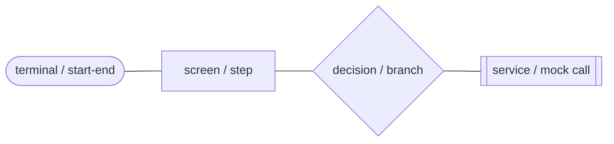

- **([rounded])** — entry/exit of a flow.
- **[rectangle]** — a screen, step (`Step`), or phase (`Phase`).
- **{diamond}** — a decision/branch (role, validation, status).
- **[[double rectangle]]** — a service or mock call (the backend seam).
- Solid arrow `-->` = primary path. Dotted `-.->` = secondary/return link.

---

## 0. Master map — all entry paths

The big picture: every way a user can reach the app, collapsed into one chart.

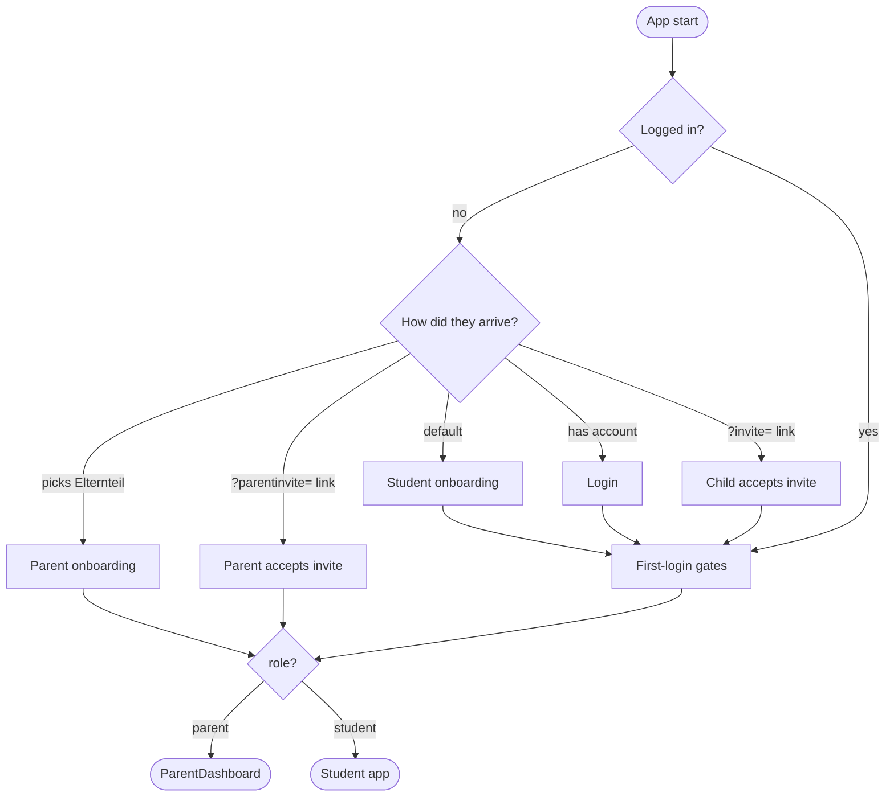

---

## 1. App entry & auth gate

*(§6 — `App.tsx`, `AuthWrapper.tsx`)*

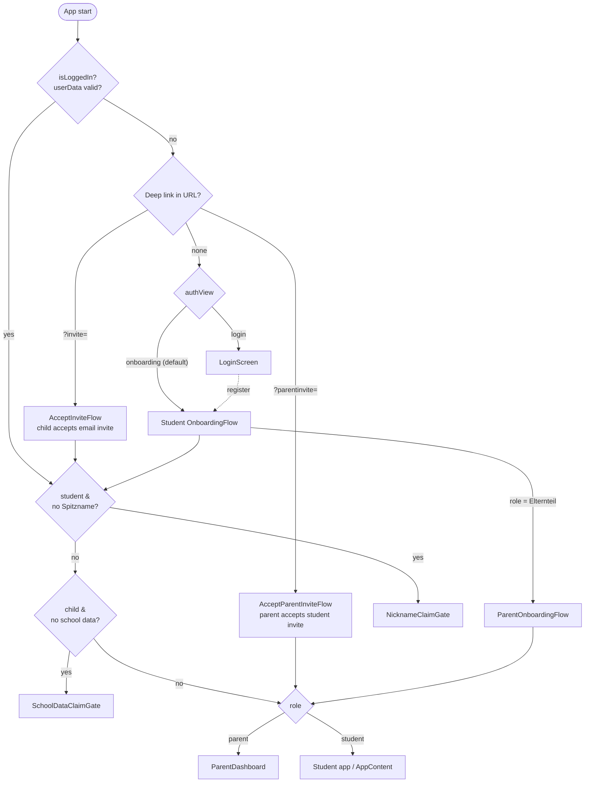

---

## 2. Student registration — flowchart

*(§7 — `onboarding/OnboardingFlow.tsx`)*

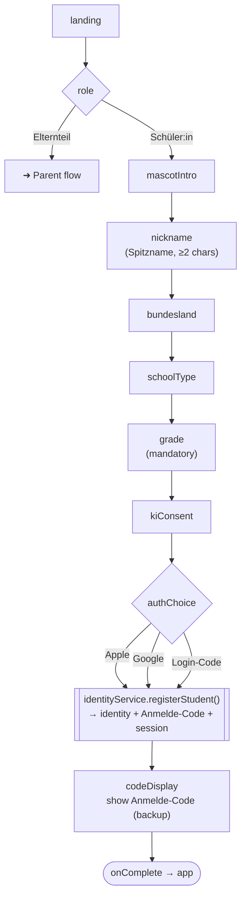

---

## 3. Student registration — sequence

Who calls what, in order. Note: a student **always** gets an Anmelde-Code, even via Apple/Google.

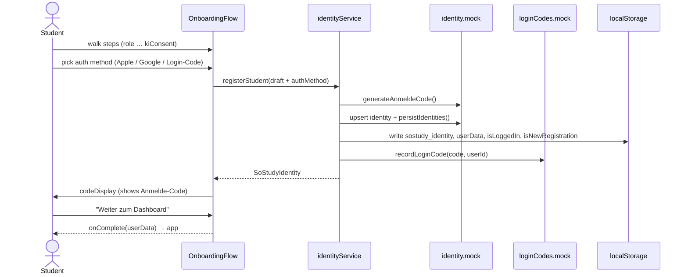

---

## 4. Parent registration — flowchart

*(§8 — `parent/ParentOnboardingFlow.tsx`)*

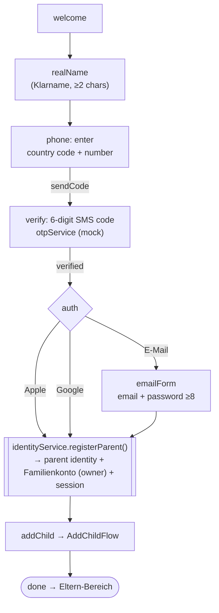

---

## 5. Parent registration — sequence

Parent registration creates **two** records (identity **and** family) and runs the phone OTP first.

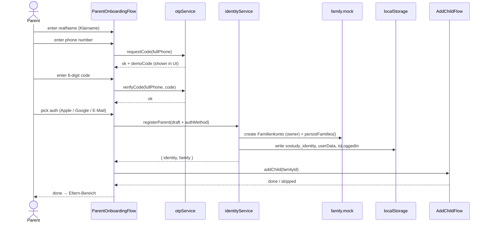

---

## 6. Phone / SMS-OTP — state machine

*(§8.1 — `hooks/usePhoneOtp.ts` + `services/otpService.ts`)*

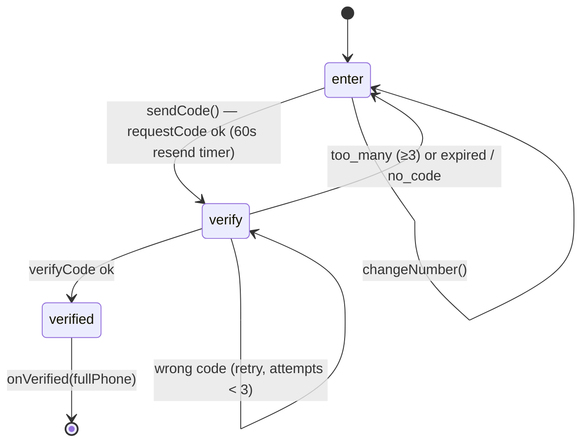

> OTP rules: 6-digit code, 10-minute TTL, 3 attempts. In the prototype the code is shown in a
> "Demo — dein SMS-Code" box (no real SMS); `requestCode` always succeeds.

---

## 7. Add a child — modes A / B / C

*(§9 — `parent/AddChildFlow.tsx` + `familyService`)*

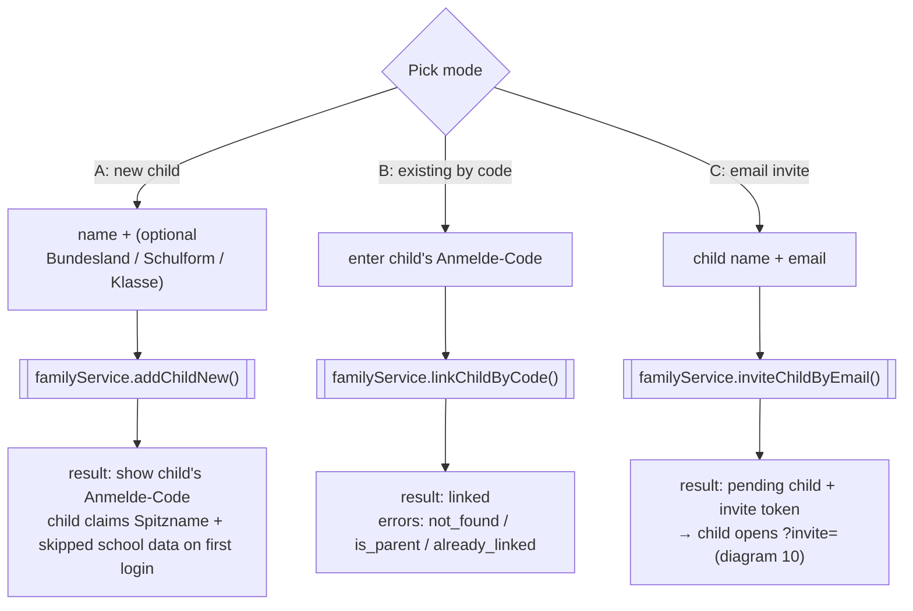

---

## 8. Login — three methods

*(§10 — `LoginScreen.tsx`)*

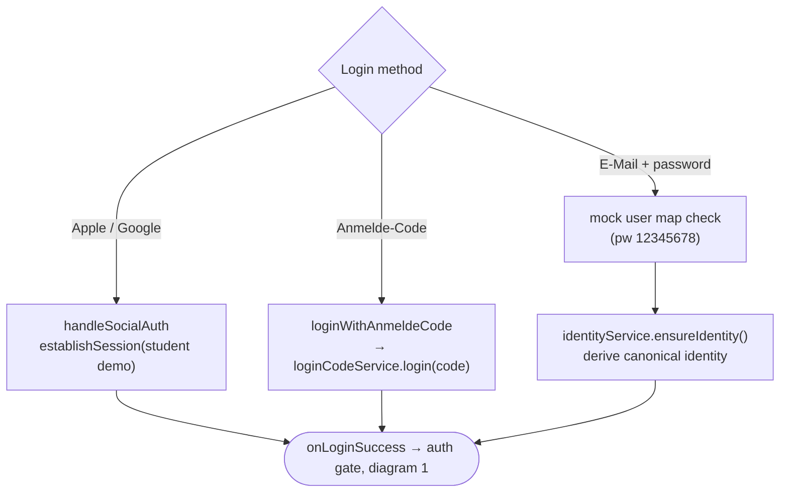

---

## 9. Anmelde-Code login — sequence

Server-side-style validation with self-healing (works even if the code store lost the entry).

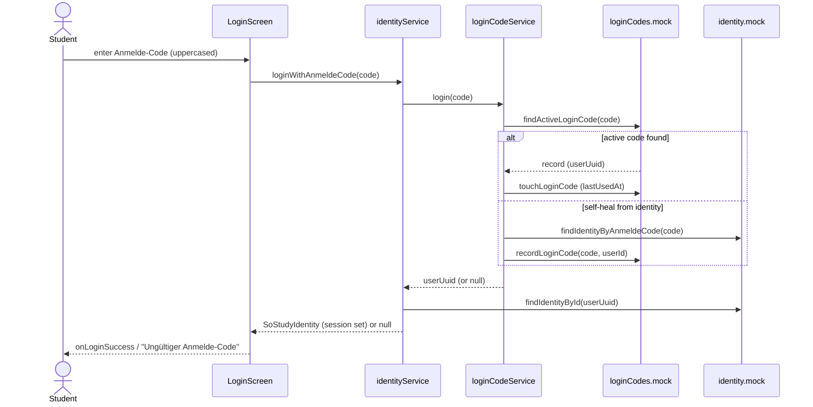

---

## 10. Invite: child accepts email invite

*(§12.1 — `?invite=` → `onboarding/AcceptInviteFlow.tsx`, mode C)*

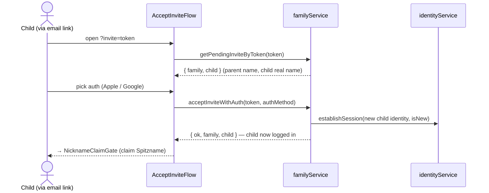

---

## 11. Invite: parent accepts student invite

*(§12.2 — `?parentinvite=` → `onboarding/AcceptParentInviteFlow.tsx`, Pfad 4)*

A self-registered student (<18, no family) invites a parent; accepting **creates the parent +
family and links the student with tutoring consent in one step**.

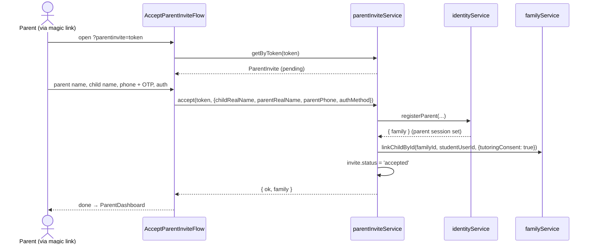

---

*Diagrams generated from the SoStudy prototype source; accurate as of the current `main` branch.
For field-level detail, storage keys, full method signatures, and the backend-migration mapping,
see [`REGISTRATION_AUTH_FLOW.md`](./REGISTRATION_AUTH_FLOW.md).*
